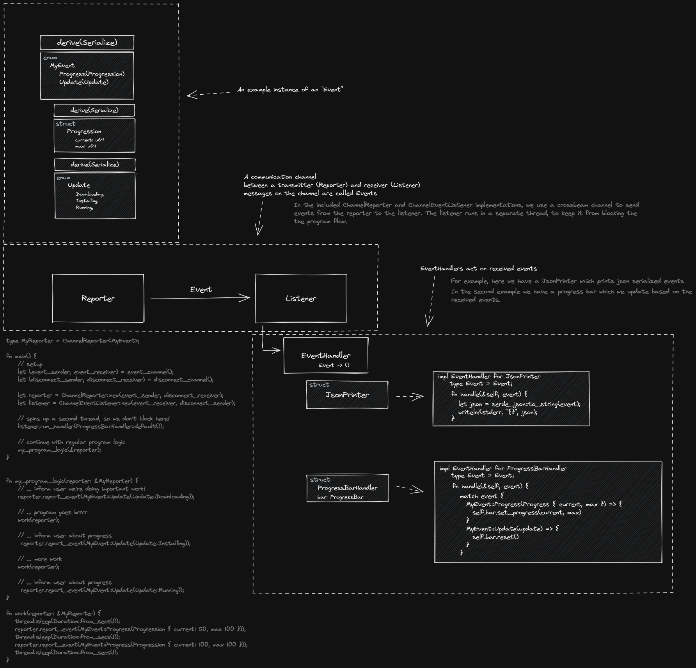

# 🎙 Storyteller
_A library for working with user output_

## Table of contents

* 👋 [Introduction](#introduction)
* 🖼 [Visualized introduction](#visualized-introduction)
* 📄 [Example source code](#example)
* ❓ [Origins](#origins)
* 💖 [Contributions & Feedback](#contributions)
* 🧾 [License](#license)

## Introduction

This library is intended to be used by tools, such as cli's, which have multiple user interface
options through which they can communicate, while also having various separate commands (or
flows) which require each to carefully specify their own output formatting.

The library consists of three primary building blocks, and a default implementation on top
of these building blocks. It helps you setup your program architecture 

The three building blocks are:
* `EventHandler`: The event handler which deals with the user output, for example:
	* A handler which formats events as json-lines, and prints them to stderr
	* A handler which updates a progress bar
	* A handler which collects events for software testing
	* A handler which sends websocket messages for each event
	* A handler which updates a user interface
    
* `Reporter`: Called during your program logic. 
	Used to communicate user output to a user. The reporter is invoked with an Event during the programs logic, so you don't have to deal with formatting and display details in the middle of the program flow.

* `EventListener`: Receives events, send by a reporter and runs the `EventHandler`. Usually spins upa separate thread so it won't block.

On top of these building blocks, a channel based implementation is provided which runs the `EventHandler`
in a separate thread. To use this implementation, consult the docs for the `ChannelReporter`, and the
`ChannelEventListener`.

In addition to these provided elements, you have to:
* Define a type which can be used as Event
* Define one or more EventHandlers (i.e. `impl EventHandler<Event = YourEventType>`).

## Visualized introduction

Click [here](https://raw.githubusercontent.com/foresterre/storyteller/main/docs/sketches/introduction_dark.svg) for a larger version. 

([light svg](https://raw.githubusercontent.com/foresterre/storyteller/main/docs/sketches/introduction.svg), [dark svg](https://raw.githubusercontent.com/foresterre/storyteller/main/docs/sketches/introduction_dark.svg), [light png](https://raw.githubusercontent.com/foresterre/storyteller/main/docs/sketches/introduction.png), [dark png](https://raw.githubusercontent.com/foresterre/storyteller/main/docs/sketches/introduction_dark.png))

## Example

```rust
use std::io::{Stderr, Write};
use std::sync::{Arc, Mutex};
use std::time::Duration;
use std::{io, thread};
use storyteller::{
    disconnect_channel, event_channel, ChannelEventListener, ChannelReporter, EventHandler,
    EventListener, Reporter,
};

// --- In the main function, we'll instantiate a Reporter, a Listener, and an EventHandler.
//     For the reporter and listener, we'll use implementations included with the library.
//     The EventHandler must be defined by us, and can be found below.
//     We also need to define our event type, which can also be found below.

// See the test function `bar` in src/tests.rs for an example where the handler is a progress bar.
fn main() {
    let (sender, receiver) = event_channel::<ExampleEvent>();
    let (disconnect_sender, disconnect_receiver) = disconnect_channel();

    // Handlers are implemented by you. Here you find one which writes jsonlines messages to stderr.
    // This can be anything, for example a progress bar (see src/tests.rs for an example of this),
    // a fake reporter which collects events for testing or maybe even a "MultiHandler<'h>" which
    // consists of a Vec<&'h dyn EventHandler> and executes multiple handlers under the hood.
    let handler = JsonHandler::default();

    // This one is included with the library. It just needs to be hooked up with a channel.
    let reporter = ChannelReporter::new(sender, disconnect_receiver);

    // This one is also included with the library. It also needs to be hooked up with a channel.
    // It's EventListener implementation spawns a thread in which event messages will be handled.
    // Events are send to this thread using channels, therefore the name ChannelEventListener ✨.
    let listener = ChannelEventListener::new(receiver, disconnect_sender);

    // Here we use the jsonlines handler we defined above, in combination with the default `EventListener`
    // implementation on the `ChannelEventListener` we used above.
    //
    // If we don't run the handler, we'll end up in an infinite loop, because our `reporter.disconnect()`
    // below will block until it receives a Disconnect message.
    // Besides, if we don't run the handler, we would not need this library =). 
    // 
    // Also: as described above, it spawns a thread which handles updates, so it won't block.
    listener.run_handler(handler);

    // Run your program's logic
    my_programming_logic(&reporter);

    // Finish handling reported events, then disconnect the channels.
    // If not called, events which have not been handled by the event handler yet may be discarded. 
    let _ = reporter.disconnect();
}

fn my_programming_logic(reporter: &ChannelReporter<ExampleEvent>) {
	#[allow(unused_must_use)] // sending events can fail, but we'll assume they won't for this example
    {
    	// These are the events we would call during the regular flow of our program, for example
	    // if we use the library in a package manager, before, during or after downloading dependencies.
	    // The use any-event-type-you-like nature allows you to go as crazy as you would like. 
        reporter.report_event(ExampleEvent::text("[status]\t\tOne"));
        reporter.report_event(ExampleEvent::event(MyEvent::Increment));
        reporter.report_event(ExampleEvent::event(MyEvent::Increment));
        reporter.report_event(ExampleEvent::text("[status::before]\tTwo before reset"));
        reporter.report_event(ExampleEvent::event(MyEvent::Reset));
        reporter.report_event(ExampleEvent::text("[status::after]\t\tTwo after reset"));
        reporter.report_event(ExampleEvent::event(MyEvent::Increment));
        reporter.report_event(ExampleEvent::event(MyEvent::Increment));
        reporter.report_event(ExampleEvent::event(MyEvent::Increment));
        reporter.report_event(ExampleEvent::event(MyEvent::Increment));
        reporter.report_event(ExampleEvent::event(MyEvent::Increment));
        reporter.report_event(ExampleEvent::event(MyEvent::Increment));
        reporter.report_event(ExampleEvent::text("[status]\t\tThree"));
        reporter.report_event(ExampleEvent::event(MyEvent::Increment));
        reporter.report_event(ExampleEvent::event(MyEvent::Increment));
        reporter.report_event(ExampleEvent::event(MyEvent::Increment));
        reporter.report_event(ExampleEvent::text("[status]\t\tFour"));
    }
}

// --- Here we define out Event Type.

// if we would have imported third-party libraries, we could have done: #[derive(serde::Serialize)]
enum ExampleEvent {
    Event(MyEvent),
    Text(String),
}

impl ExampleEvent {
    pub fn event(event: MyEvent) -> Self {
        Self::Event(event)
    }

    pub fn text<T: AsRef<str>>(text: T) -> Self {
        Self::Text(text.as_ref().to_string())
    }
}

impl ExampleEvent {
    // Here we create some json by hand, so you can copy the example without importing other libraries, but you can also
    // replace all of this by, say `serde_json`, and derive a complete json output of your `Event` definition all at once (by design™ =)).
    pub fn to_json(&self) -> String {
        match self {
            Self::Event(event) => event.to_json(),
            Self::Text(msg) => format!("{{ \"event\" : \"message\", \"value\" : \"{}\" }}", msg),
        }
    }
}

enum MyEvent {
    Increment,
    Reset,
}

impl MyEvent {
    pub fn to_json(&self) -> String {
        match self {
            Self::Increment => format!("{{ \"event\" : \"increment\" }}"),
            Self::Reset => format!("{{ \"event\" : \"reset\" }}"),
        }
    }
}

// --- Here we define an Event Handler which deals with the user output.

struct JsonHandler {
    stream: Arc<Mutex<Stderr>>,
}

impl Default for JsonHandler {
    fn default() -> Self {
        Self {
            stream: Arc::new(Mutex::new(io::stderr())),
        }
    }
}

impl EventHandler for JsonHandler {
    type Event = ExampleEvent;

    fn handle(&self, event: Self::Event) {
        /* simulate some busy work, so we can more easily follow the user output */
        thread::sleep(Duration::from_secs(1));
        /* simulate some busy work */
        let message = event.to_json();

        let mut out = self.stream.lock().unwrap();
        let _ = writeln!(out, "{}", message);
        let _ = out.flush();
    }

    fn finish(&self) {
        let mut out = self.stream.lock().unwrap();

        let message = format!("{{ \"event\" : \"program-finished\", \"success\" : true }}");

        let _ = writeln!(out, "{}", message);
        let _ = out.flush();
    }
}

```

## Origins

This library is a refined implementation based on an earlier [experiment](https://github.com/foresterre/rust-experiment-air3/blob/main/src/main.rs).
It is intended to be used by, and was developed because of, [cargo-msrv](https://github.com/foresterre/cargo-msrv) 
which has outgrown its current user output implementation.

## Contributions

Contributions, feedback or other correspondence are more than welcome! Feel free to send a message or create an issue 😄.

## License

Licensed under either of

* Apache License, Version 2.0, ([LICENSE-APACHE](LICENSE-APACHE) or http://www.apache.org/licenses/LICENSE-2.0)
* MIT license ([LICENSE-MIT](LICENSE-MIT) or http://opensource.org/licenses/MIT)

at your option.


#### Contribution

Unless you explicitly state otherwise, any contribution intentionally
submitted for inclusion in the work by you, as defined in the Apache-2.0
license, shall be dual licensed as above, without any additional terms or
conditions.
